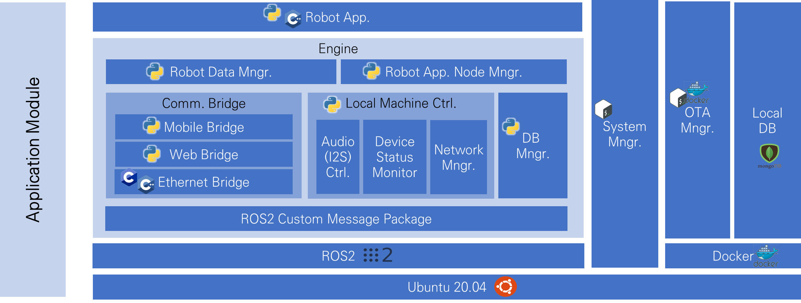

# ST-Link

### Requirements

* [STM32CubeProgrammer](https://www.st.com/en/development-tools/stm32cubeprog.html) v2.8.0 or newer.

### Download Binary File

* You can find released bin files on [github page](https://github.com/AGR-SW/lost\_bagel\_chips/releases).

### Connect to Target

.png>)

* Be sure your H/W is connected correctly!

### Program the Binary File

* Aware of the settings!
